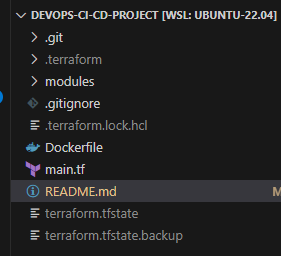
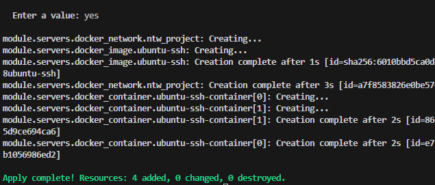
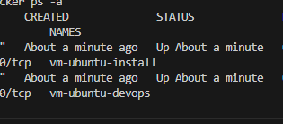
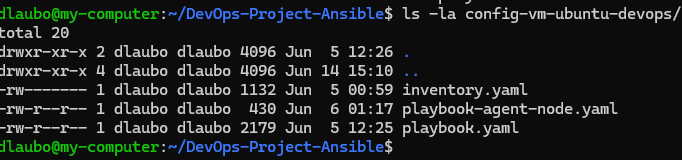
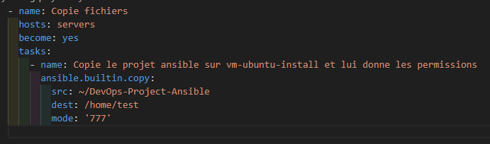
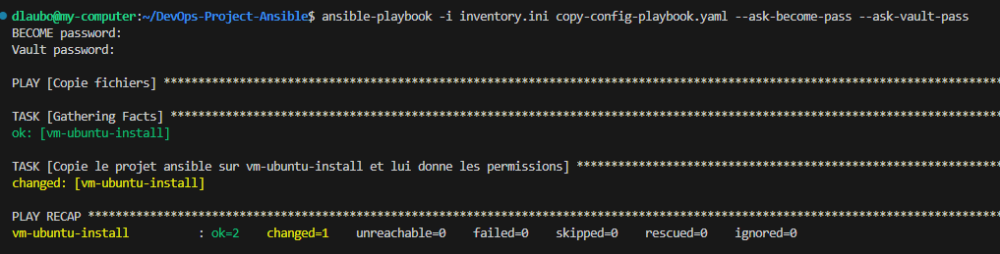
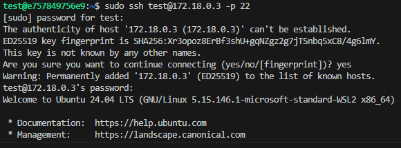
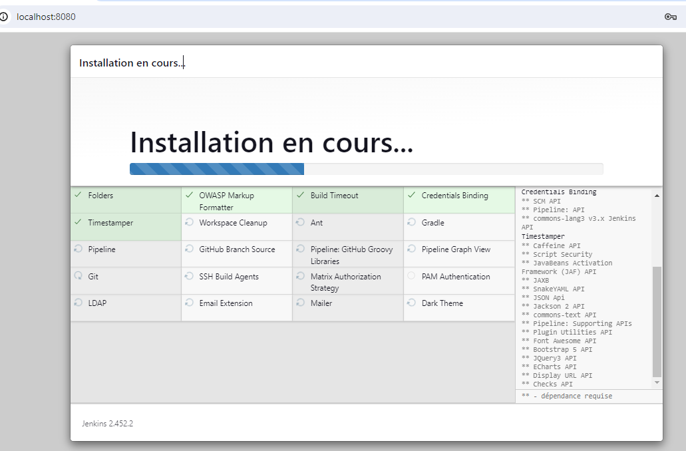
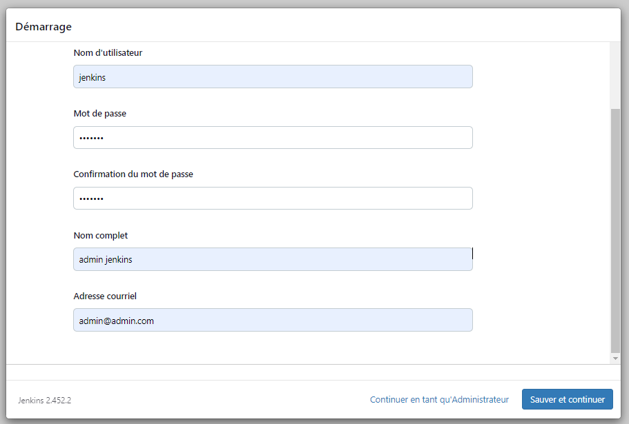

Projet Devops

Introduction
Ce projet préparer l'environnement et les outilis nécéssaires pour faire un Projet DevOps CI/CD et CD/CD
d'un projet ReactJS

Déploiement de l'infrastructure avec terraform
Création de l'image ubunut-ssh à partir de Dockerfile de l'image fredericeducentre/ubuntu-ssh préalablement préparée avec ssh entre autres.
j'y ajoute l'installation de sshpass, docker, Terraform et Ansible

Création de 2 conteneures vm-ubuntu-install et vm-ubuntu-DevOps à partir de l'image ubuntu-ssh
les 2 VM seront installer dans le même network : ntw_devops pour permettre la communication entre les 2

Le projet DevOps-CI-CD-Project

Lancer la commande "docker build . -t ubuntu-ssh" à la racine du rpojet DevOps-CI-CD-Project
pour créer l'image ubuntu-ssh à partir du Dockerfile y présent

Pour que les conteneurs vm-ubuntu-install et vm-ubuntu-DevOps à créer à partir de l'image ubuntu-ssh préparée précédement, fonctionnent correctement avec docker configurer dans le fichier terraform 
modules/main.tf 
un bloc mount sur le /var/run/docker.sock du docker installé en local sur l'environnement de l'exécution.
Ce mount permettra au conteneurs vm-ubuntu-install et vm-ubuntu-DevOps d'intéragir avec docker.

La ressource docker_container dans le fichier modules/main.tf aura le bloc mounts suivant:
mounts {
    type   = "bind"
    source = "/var/run/docker.sock"
    target = "/var/run/docker.sock"
  }

Les variables et l'automatisation de création de 2 conteneures (noms) est pris en compte dans le projet.

Se mettre à la racine du projet et lancer les commandes suivantes pour créer les conteneurs vm-ubuntu-install et vm-ubuntu-DevOps

Initialiser le projet terraform
terraform init

Lister les actions qui seront exécutées avec terraform
terraform plan

Exécuter les actions configurées dans le fichier main.tf de terraform
terraform apply

Vérifier que les 2 vm tournent et tester l'accès ssh

pour vm-ubuntu-install ==>   ssh test@localhost -p 6023
pour vm-ubuntu-DevOps  ==>   ssh test@localhost -p 6024

penser à récuperer l'empreinte SSH et faire update du registre des clés SSH
Exemple:    ssh-keygen -f "/home/dlaubo/.ssh/known_hosts" -R "[localhost]:6023"

Le compte test/test et root/test sont actives dans le contenaire vm-ubuntu-install
A l'intérieur du contenaire, passer root ou utiliser sudo pour exécuter les docker ==> docker ps -a

Dans le conteneur vm-ubuntu-install
Ce conteneur sera préparé avec le projet Ansible 'DevOps-Project-Ansible' qu'on trouve dans le répertoire /home/test
Lui même sera déposé dans le conteneur via un projet Ansible qui utilisera SSH pour y copier le dossier config-vm-ubuntu-devops avec les
fichiers inventory.yaml, playbook-agent-node.yaml, playbook.yaml

Le projet 'DevOps-Project-Ansible' sera copié dans le conteneur vm-ubuntu-DevOps pour configurer le conteneur vm-ubuntu-DevOps

Dans ce projet, le répertoire /config-vm-ubuntu-devops contient le fichier playbook.yaml pour installer docker, jenkins, sonardb (postgres) et sonnarqube
Le fichier playbook-agent-node.yaml pour installer l'agent node agent_reactjs_node pour le bon fonctionnement d'un projet reactJS
En occurence l'agent "fredericeducentre/jenkins_agent_node" utilisé pendant les cours
Le fichier inventaire.yaml contient la configuration du serveur (conteneur) vm-ubuntu-DevOps pour accéder en SSH. Ce fichier inventory.yaml est crypté ==> mot de passe vault= secret

Les playbook.yaml et playbook-agent-node.yaml du dossier config-vm-ubuntu-devops utiliseront cet inventory.yaml crypté

A la racine du projet:
dans l'inventory.yaml voici la configuration de l'accès ssh au conteneur cible:

vm-ubuntu-install ansible_host=localhost ansible_user=test ansible_ssh_pass=test ansible_port=6023

copy-config-playbook.yaml

Lancer copy-config-playbook.yaml à la racine de ce projet pour faire copier le projet 'DevOps-Project-Ansible' dans le conteneur vm-ubuntu-install

ansible-playbook -i inventory.ini copy-config-playbook.yaml --ask-become-pass --ask-vault-pass

Sur le conteneur vm-ubuntu-install et dans le dossier /home/test/DevOps-Project-Ansible
Le projet est copié. Dans le dossier /config-vm-ubuntu-devops:
Lancer la commande suivante pour installer la clé ssh sur vm-ubuntu-install avant d'exécuter le playbook.yaml en précisant l'@IP de vm-ubuntu-devops ==> vérifier l'@IP de votre conteneur par docker inspect vm-ubuntu-devops
sudo ssh test@172.18.0.3 -p 22

Taper exit pour sortir du conteneur.

Dans le dossier /home/test/DevOps-Project-Ansible/config-vm-ubuntu-devops
configurer inventory.yaml avec l'adresse IP du conteneur vm-ubuntu-devops
Appliquer ou pas le vault pour crypter le fichier. Dans mon cas c'est crypté.

Exécuter le playbook.yaml pour installer docker, jenkins, sonnardb et sonnarqube sur vm-ubuntu-devops

sudo ansible-playbook -i inventory.yaml playbook.yaml --ask-become-pass --ask-vault-pass
become-pass=test
vault-pass=secret

Vérifier que l'installation est bien passée sur vm-ubuntu-DevOps
Dans contenauer vm-ubuntu-DevOps
Nous y trouverons installés: 
docker, jenkins sur le port 8080  sonnarqube sur le port 9000
Aller se connecter sur jenkins ==> http://localhost:8080/
Le mot de passe demandé se trouvera dans le fichier /var/*** indiqué du conteneur jenkins_container ou par la commande deocker logs jenkins_container
renseigner le mot de passe
continuer la configuration par : jenkins ==> utilisateur: jenkins - password: jenkins - nom complet: lauboudou jenkins - Email: admin@admin.com

tester l'exécution d'un pipeline pour confirmer le bon fonctionnement de jenkins
Si le pipeline stage view n'est pas visible penser à vérifier si le plugin pipeline stage view est installé sinon installer le et redémarrer jenkins

Configuer l'agent node sur jenkins
Aller dans Administrer Jenkins > Nodes > Créer un nouveau node : agent_reactjs_node
passer le nombre d'exécution sur le node controlleur à 0

Dans le conteneur vm-ubuntu-install
Aller dans le répertoire /home/test/DevOps-Project-Ansible/config-vm-ubuntu-devops
lancer le playbook-agent-node.yaml pour installer l'agent node agent_reactjs_node

sudo ansible-playbook -i inventory.yaml playbook-agent-node.yaml --ask-become-pass --ask-vault-pass
become-pass=test
vault-pass=secret

l'agent jenkins_agent_node sera installé, assurer qu'il soit démarré
tester l'exécution d'un pipeline en utilisant ce nouveau node avec un projet reactjs

Configurer sonnarqube sur http://localhost:9000/ ==> utilisateur: admin password: admin puis changer le password à sonar
-----------------------------------------------------------------------
maintenant sur jenkins
ajouter un plugin sonarqube
Administrer jenkins > system > ajouter plugin sonarqube > redémarrer
Créer un projet de test sur Sonarqube ==> Test-horoscope-zodiac-js
pour ce projet configurer un token sans utilisateur en local
le token sera utilisé dans un pipeline comme suit
stage('Scan'){
     steps {
        sh '''
          sonar-scanner \
          -Dsonar.projectKey=Test-horoscope-zodiac-js \
          -Dsonar.sources=. \
          -Dsonar.host.url=http://localhost:9000 \
          -Dsonar.token=sqp_a8868724a4f50bbb4ac1e1a9cf51dd0e19cad087
        '''
    }
}

pour l'utilisation de Quality Gate de Sonarqube afin d'appliquer les règles de validation configurer un webhook sur sonarqube qui sera également configuré sur l'installation sonarqube de jenkins
sur sonarqube configurer un webhook général avec l’url http://172.20.0.2:8080/sonarqube-webhook
Aller dans Administration > Configuration > Webhooks
Créer un nouveau webhook avec l'@IP du serveur jenkins (jenkins_container) ==> 172.20.0.2

Sur le serveur jenkins, aller dans Administrer jenkins > system > chercher la partie de configuration de sonar > ajouter une installation Sonarqube
Donner un nom à cette installation ==> jenkins_sonarqube
Utiliser le credential sonar créé précédement ==> dans un secret text
pas de password, donner un nom à ce crédéntial et attacher le à l'installation sonarqube

passer un pipeline avec les stages Clone, Test, Build, Scan et Quality Gate
# le pipeline passe et le projet Sonarqube Test_reactJS contiendra les métriques de test

# Delivery de l'image sur hub.docker.com
# préparer un credential pour l'accès au compte hub.docker.com qui réscevra l'image
# préparer le stage Delivery
# faire passer un projet par les stages d'un pipeline
# Clone, Test, Build, Scan, Quality Gate, Delivery
# Vérifier que le push de l'image est bien pasé

Lancer cette commande pour installer le registry de docker

docker run -d -p 5000:5000 --restart always --name registry registry:2

Il sera utilisé pour la sauvegarde en local des images docker